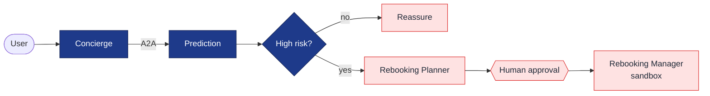

# Flight Disruption Concierge

A multi-agent AI system that predicts a flight's **delay/cancellation risk** from public
pre-departure data and—on high risk—proposes and (with human approval) books an alternative.

Built for the **Kaggle AI Agents Intensive — Vibe Coding Capstone**.
**Track:** Concierge Agents · **Stack:** Google ADK + A2A + MCP

---

## Start here

| If you want to… | Read |
|---|---|
| Understand the whole plan (architecture, agents, data, eval, roadmap) | **[docs/DESIGN.md](docs/DESIGN.md)** ← authoritative |
| See earlier exploration (Agents-for-Business proposals) | [docs/capstone_project_proposals.md](docs/capstone_project_proposals.md) (background) |

## What it does (in one diagram)



Prediction is one box here; its four specialist agents + data sources, plus the
runtime sequence, are in **[docs/DESIGN.md §2](docs/DESIGN.md)**.

- **Predict:** fuse free public signals (weather forecasts, FAA airspace status, inbound-aircraft,
  historical model) into a calibrated delay/cancellation risk + the dominant cause.
- **Act:** find alternatives, get human sign-off, book in a **sandbox** (no real money).
- **Prove it:** backtest predictions against labeled historical outcomes — the project's differentiator.

## Why multi-agent
Specialist agents each own one signal/data source and communicate over **A2A**; data access is via
**MCP** servers. The value is explainable, composable reasoning over live + historical data — not a
single black-box score. See [DESIGN.md §2](docs/DESIGN.md) for the full rationale.

## Status & roadmap
Design complete; implementation not started. Build order (ship the spine first):

| Phase | Deliverable |
|---|---|
| **MVP-1** | Concierge (resolves flight context) + Prediction (historical prior) + backtest |
| **MVP-2** | + Weather & NAS live agents via MCP |
| 3–5 | Rebooking Planner → HITL gate + sandbox Manager → Aircraft agent + observability + demo |

Full detail in [docs/DESIGN.md §8](docs/DESIGN.md).

## Data
Historical prior/eval: `divyansh22/flight-delay-prediction` (US DOT BTS, Jan 2019/2020), target `ARR_DEL15`.
Live signals: aviationweather.gov, FAA ASWS, OpenSky (all free). Booking: Amadeus/Duffel **sandbox**.

## Proposed repo layout
```
agents/  mcp_servers/  data/  eval/  common/  app/  docs/
```
