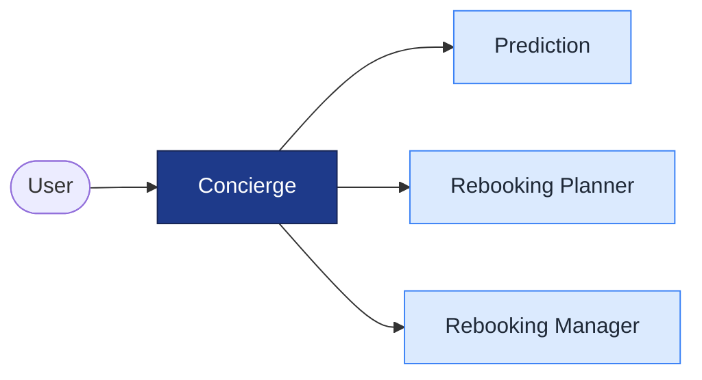

# Flight Disruption Concierge

A multi-agent AI system that predicts a flight's **delay/cancellation risk** from public
pre-departure data and—on high risk—proposes and (with human approval) books an alternative.

Built for the **Kaggle AI Agents Intensive — Vibe Coding Capstone**.
**Track:** Concierge Agents · **Stack:** Google ADK + A2A + MCP

---

## Quickstart

**Prerequisites:** Python 3.11+, **[uv](https://astral.sh/uv)**, and **Node.js / npx**
(the weather and flight MCP servers are launched on demand via `npx`/`uvx`).

```bash
make install      # uv sync
make setup        # installs deps + downloads/verifies the MCP servers (first run is slow)
make playground   # launches the ADK dev UI on http://127.0.0.1:8080
```
Then open **http://127.0.0.1:8080** and **select the `playground` app** in the dropdown
(the dev UI lists every folder as an "app" — `playground` is the runnable one). Ask e.g.
*"6pm flight from Seattle to SFO tomorrow"* and watch the trace.

> Other targets: `make test`, `make train`, `make backtest` (see **Data & model** below).

**Troubleshooting** — *"Tool 'search_flights'/'get_forecast' not found"*: the MCP server
didn't start. Run `make setup` and confirm `uvx --version` and `npx --version` work — a
missing runner or blocked network is the usual cause.

---

## Start here

| If you want to… | Read |
|---|---|
| Understand the whole plan (architecture, agents, data, eval, roadmap) | **[docs/DESIGN.md](docs/DESIGN.md)** ← authoritative |
| See earlier exploration (Agents-for-Business proposals) | [docs/capstone_project_proposals.md](docs/capstone_project_proposals.md) (background) |

## What it does (in one diagram)



Prediction's four specialist agents, the rebooking/HITL flow, and the runtime
sequence are in **[docs/DESIGN.md §2](docs/DESIGN.md)**.

- **Predict:** fuse free public signals (weather forecasts, FAA airspace status, inbound-aircraft,
  historical model) into a calibrated delay/cancellation risk + the dominant cause.
- **Act:** find alternatives, get human sign-off, book in a **sandbox** (no real money).
- **Prove it:** backtest predictions against labeled historical outcomes — the project's differentiator.

## Why multi-agent
Specialist agents each own one signal/data source and communicate over **A2A**; data access is via
**MCP** servers. The value is explainable, composable reasoning over live + historical data — not a
single black-box score. See [DESIGN.md §2](docs/DESIGN.md) for the full rationale.

## Status
Working end-to-end: Concierge → Prediction → {Prior, Weather} over A2A, with **two keyless
MCPs** (flight search via `uvx fli`, weather via `npx @dangahagan/weather-mcp`) and a **trained
delay model + backtest**. Remaining: rebooking + HITL, deployment, and the writeup/video.
Full roadmap in [docs/DESIGN.md §8](docs/DESIGN.md).

## Data & model

**Dataset:** `divyansh22/flight-delay-prediction` (US DOT BTS, Jan 2019/2020), target `ARR_DEL15`.
The CSVs and trained artifacts are **gitignored** (not in the repo) — regenerate locally:

```bash
# 1. place Jan_2019_ontime.csv and Jan_2020_ontime.csv in data/  (from the Kaggle dataset)
make train      # -> data/model.pkl + data/cancel_rates.json   (LogisticRegression on Jan 2019)
make backtest   # -> AUC + Brier + calibration on the Jan-2020 holdout
```

If `data/model.pkl` is **absent, the Prior agent falls back to a rule-of-thumb** — so the system
still runs without training; `make train` just upgrades it to the real model.

**Live signals:** flight search (Google Flights via `fli`), weather (NWS/Open-Meteo) — both keyless.

## Repo layout
```
agents/   concierge, prediction, prior, weather  (+ A2A entrypoints)
skills/   per-agent SKILL.md (agentskills.io frontmatter + instructions)
data/     train_model.py            (model.pkl, cancel_rates.json, *.csv gitignored)
eval/     backtest.py
playground/  in-process composition for the dev UI
scripts/  prewarm.py                (MCP server pre-warm/verify)
docs/     DESIGN.md
```


