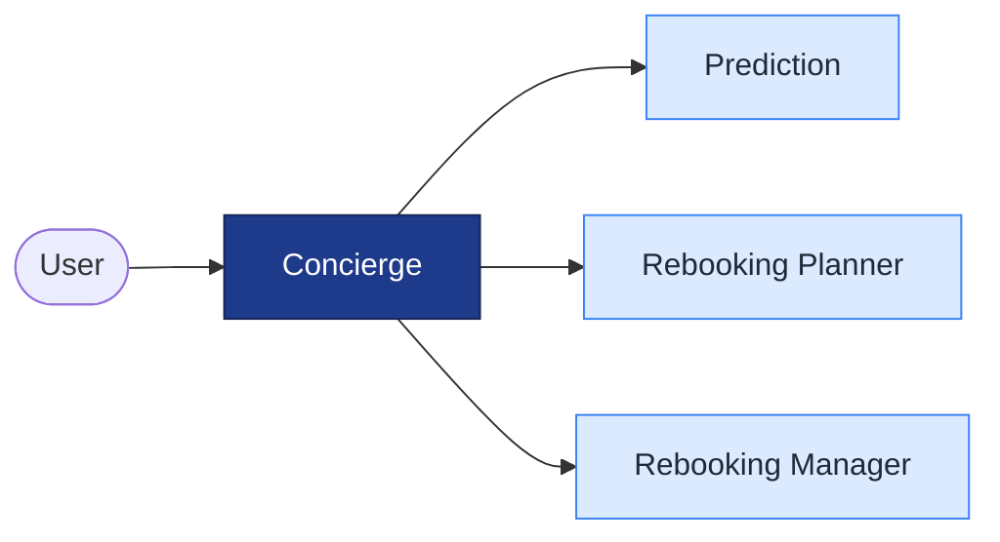
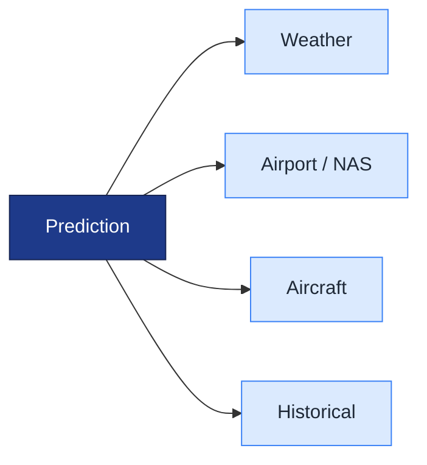
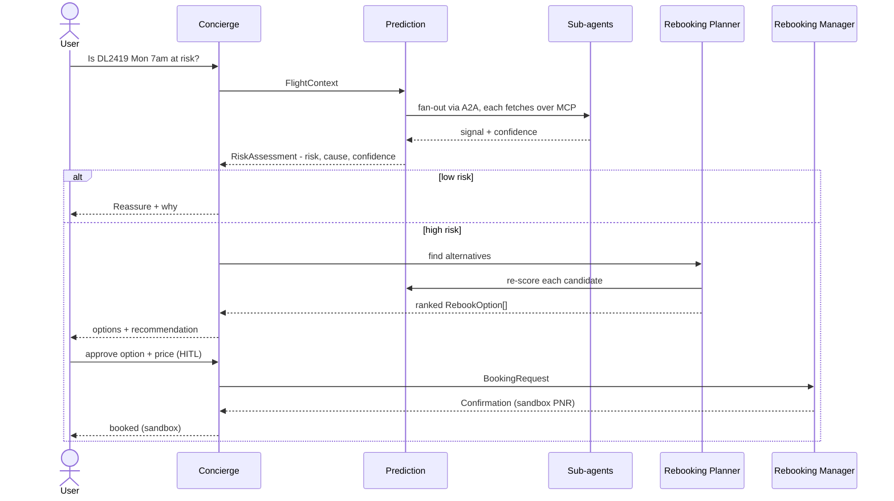

# Flight Disruption Concierge — Design

A multi-agent system that predicts a flight's delay/cancellation risk from public
pre-departure data, and—on high risk—proposes and (with human approval) books an
alternative. Built for the Kaggle *AI Agents Intensive — Vibe Coding Capstone*.

**Track:** Concierge Agents · **Framework:** Google ADK + A2A + MCP

---

## 1. Goals & Non-Goals

**Goals**
- Predict `delay (ARR_DEL15)` and `cancellation` risk for a specific flight, pre-departure.
- Explain *why* (dominant cause) and recommend an action.
- Demonstrate the course skills: **multi-agent, MCP, A2A, HITL, evaluation, observability**.
- Be **evaluable**: backtest predictions against labeled historical outcomes.

**Non-Goals**
- Real money or real ticketing. Booking/payment is **sandbox/simulated** only.
- Beating an ML leaderboard. The model is deliberately simple; the agent system is the work.
- Live, second-by-second accuracy. We predict from forecasts/known state at request time.

---

## 2. Architecture

### 2.1 System overview
The Concierge orchestrates three agents. (Prediction's internals are in §2.2.)



### 2.2 Prediction agent
Prediction asks four specialists and combines their signals.



Protocols: Concierge↔agents and Prediction↔specialists use **A2A**; each specialist
reads its data source (aviationweather, FAA ASWS, OpenSky, Flight DB) over **MCP**.

**Runtime flow**



Cross-cutting: Evaluation · Observability (log/trace/metrics) · Resumable session/memory.
**Boundaries:** agent→agent = **A2A** (agent cards); agent→data/tool = **MCP**.

---

## 3. Agent Roster

| Agent | Responsibility | Inputs → Output |
|---|---|---|
| **Concierge** | Resolves the request (NL flight ref → `FlightContext`), orchestrates, holds state, applies decision policy, manages HITL | user request → final answer/action |
| **Prediction** | Fuse sub-signals into one calibrated risk + cause | `FlightContext` → `RiskAssessment` |
| ↳ Weather | Origin+dest forecast/conditions signal | airports, time → signal |
| ↳ Airport/NAS | Active ground stops / delay programs | airports → signal |
| ↳ Aircraft | Inbound-aircraft (cascade) signal | tail/time → signal |
| ↳ Historical/Prior | Trained model + base rates; fallback when live fails | features → calibrated prior |
| **Rebooking Planner** | Find & rank alternatives; re-score their risk | `FlightContext` → `RebookOption[]` |
| **Rebooking Manager** | Execute booking + payment in sandbox, post-approval | `BookingRequest` → `Confirmation` |

---

## 4. Data Sources (all free for pre-departure signal)

| Signal | Source | Auth | Availability |
|---|---|---|---|
| Weather (origin+dest) | aviationweather.gov (TAF/METAR) | none | forecast ~24–30h ahead |
| Airport/airspace | FAA ASWS — nasstatus.faa.gov | none | current + active GDPs |
| Inbound aircraft | OpenSky Network | OAuth2 (free, 4k/day) | sharpens near departure |
| Historical prior | BTS flight dataset (`divyansh22/flight-delay-prediction`, Jan 2019/2020) + trained model | n/a (local) | static |
| Alternatives / booking | Amadeus or Duffel **sandbox** (or simulated) | test key | sandbox only |

> Google Flights has no public API — do **not** scrape it. Use a sandbox flight API or a fixture.

---

## 5. Data Contracts

```
FlightContext   { carrier, flight_no, origin, dest, sched_dep_utc,
                  dep_time_blk, day_of_week, tail?, connection_buffer_min? }

RiskAssessment  { p_delay15, p_cancel, confidence,
                  dominant_cause ∈ {weather,nas,late_aircraft,carrier},
                  per_agent_signals[], explanation }

RebookOption    { option_id, new_flight, depart, arrive, price, fare_rules,
                  predicted_risk }

BookingRequest  { option_id, price, pax, payment_token,
                  idempotency_key } → Confirmation { pnr, status }
```

**Decision policy (Concierge):** propose rebooking if
`p_cancel > 0.30` OR `p_delay15 > 0.50` OR `expected_delay > connection_buffer`; else reassure.
Thresholds are configurable and are themselves an eval target.

---

## 6. Evaluation (the differentiator)

1. **Prediction backtest** — train on Jan 2019, score on Jan 2020; report AUC + calibration
   on held-out flights. This is ground-truth eval that prior winners lacked.
2. **Decision-policy quality** — false-positive/negative rate of the rebooking trigger.
3. **Agent-output quality** — golden Q&A set + LLM-as-judge for groundedness of explanations.
4. **Determinism/regression** — ADK evalset; gate merges on metric regressions.

---

## 7. Safety & Trust

- **No real transactions.** Booking + payment run against sandbox APIs or mocks.
- **Mandatory HITL** before any booking action (pause/resume; human approves a specific option + price).
- **Guards:** budget cap, idempotency key (no double-booking), graceful API-failure fallback to prior.

---

## 8. Roadmap (incremental — ship the spine first)

| Phase | Deliverable | Skills proven |
|---|---|---|
| **MVP-1** | Concierge (resolves context) + Prediction(Historical/Prior only) + backtest | multi-agent, eval |
| **MVP-2** | + Weather & NAS live agents via MCP | MCP, A2A |
| 3 | + Rebooking Planner (simulated alternatives) + re-predict loop | A2A negotiation |
| 4 | + HITL gate + sandbox Rebooking Manager | HITL, long-running, state |
| 5 | + Aircraft agent (OpenSky) + observability + demo video | full stack, deploy |

**MVP = Phases 1–2** — already a complete, eval-backed, demoable system.

---

## 9. Proposed Repo Layout

```
flight-disruption-concierge/
  agents/        concierge, prediction, weather, nas, aircraft, prior, planner, manager
  mcp_servers/   weather, nas, opensky, flightdb        (each wraps one data source)
  data/          dataset loader, trained model artifact, aggregate views
  eval/          backtest, evalset.json, llm_judge
  common/        contracts (schemas), config, observability
  app/           CLI / chat entrypoint
  DESIGN.md      this document
```

---

## 10. Glossary

- **ARR_DEL15** — arrival delayed ≥15 min (binary target).
- **GDP** — FAA Ground Delay Program.
- **Cascade / late-arriving aircraft** — biggest delay cause; the inbound plane was already late.
- **HITL** — human-in-the-loop approval gate.
- **A2A / MCP** — agent-to-agent protocol / Model Context Protocol (agent↔tool).
