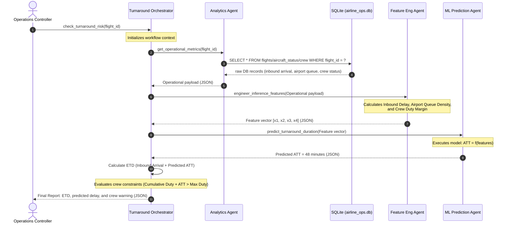
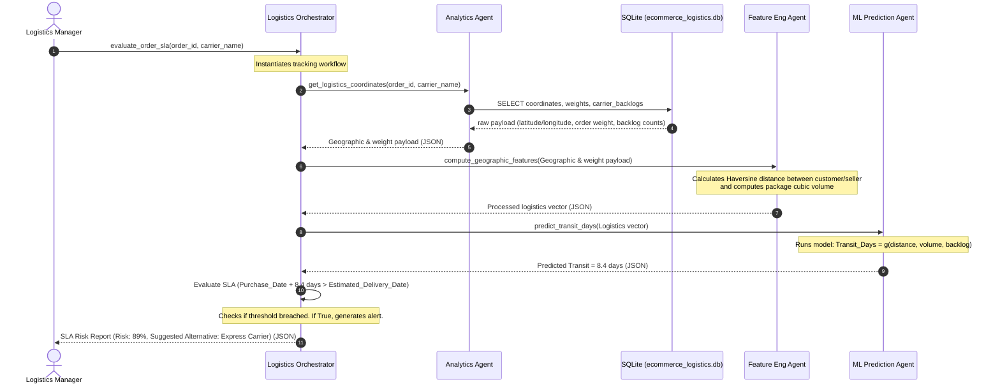

# Kaggle AI Agents Capstone: Technical System Proposals (Business Track)

This document contains two concrete, production-ready system architecture designs for the **Agents for Business** capstone track. Both designs are structured to implement a multi-agent system using the Google Agent Development Kit (ADK), local SQLite storage, and machine learning components.

---

## Proposal 1: Aviation Gate Turnaround & Departure Delay Predictor

### 1. Operational Problem Statement
When an inbound commercial aircraft is delayed, its next scheduled flight is immediately put at risk of a departure delay. To mitigate downstream delays, the airline Operations Control Center (OCC) requires a realistic Estimate Time of Departure (ETD). This system predicts the **Actual Turnaround Time (ATT)** (the duration required to deplane, service, and re-board the aircraft) and the resulting departure delay, accounting for airport-level congestion, tail-specific history, and active crew schedules.

### 2. Database Schema (SQLite DDL)
To support analytics and model inference, the local database (`airline_ops.db`) uses the following schema:

```sql
-- Aircraft inventory and real-time status
CREATE TABLE aircraft_status (
    tail_number TEXT PRIMARY KEY,
    aircraft_type TEXT NOT NULL,
    current_status TEXT NOT NULL CHECK(current_status IN ('In-Flight', 'At-Gate', 'Maintenance', 'AOG')),
    inbound_delay_minutes INTEGER DEFAULT 0,
    next_scheduled_flight TEXT
);

-- Active flight logs matching the DOT dataset structure
CREATE TABLE flights (
    flight_id TEXT PRIMARY KEY,
    tail_number TEXT NOT NULL,
    carrier TEXT NOT NULL,
    origin_airport TEXT NOT NULL,
    destination_airport TEXT NOT NULL,
    scheduled_arrival DATETIME NOT NULL,
    actual_arrival DATETIME,
    scheduled_departure DATETIME NOT NULL,
    actual_departure DATETIME,
    FOREIGN KEY(tail_number) REFERENCES aircraft_status(tail_number)
);

-- Airport congestion and logistics metrics
CREATE TABLE airport_metrics (
    airport_code TEXT PRIMARY KEY,
    current_departure_queue_count INTEGER NOT NULL,
    avg_taxi_out_minutes REAL NOT NULL,
    last_updated TIMESTAMP DEFAULT CURRENT_TIMESTAMP
);

-- Crew schedule and duty limits
CREATE TABLE crew_assignments (
    flight_id TEXT NOT NULL,
    crew_member_id TEXT NOT NULL,
    duty_start_time DATETIME NOT NULL,
    cumulative_duty_hours REAL NOT NULL,
    max_duty_hours REAL DEFAULT 14.0,
    PRIMARY KEY(flight_id, crew_member_id),
    FOREIGN KEY(flight_id) REFERENCES flights(flight_id)
);

CREATE INDEX idx_flights_tail ON flights(tail_number);
CREATE INDEX idx_flights_airports ON flights(origin_airport, destination_airport);
```

### 3. Agent Architecture & Execution Sequence
The system uses three ADK agents coordinated by a centralized Orchestrator:

1. **Analytics Agent (`AnalyticsAgent`):** Interacts with `airline_ops.db` to pull historical gate turnaround data, active delays, and crew duty statuses.
2. **Feature Engineering Agent (`FeatureEngAgent`):** Consolidates raw database queries, computes elapsed durations, and scales features for model ingestion.
3. **ML Prediction Agent (`MLPredictionAgent`):** Evaluates engineered features against a trained regression model to output expected turnaround durations.



### 4. Agent Interface Contracts
#### Analytics Agent API
* **Input Payload:**
  ```json
  {
    "flight_id": "UA1520"
  }
  ```
* **Output Payload:**
  ```json
  {
    "tail_number": "N142UA",
    "inbound_arrival_delay_minutes": 35,
    "origin_airport": "ORD",
    "departure_queue_count": 18,
    "avg_taxi_out_minutes": 22.4,
    "max_crew_duty_hours": 14.0,
    "current_crew_duty_hours": 12.5
  }
  ```

#### Feature Engineering Agent API
* **Input Payload:** Output from `AnalyticsAgent`.
* **Output Payload (Feature Vector):**
  ```json
  {
    "features": {
      "inbound_delay_scaled": 0.583,
      "airport_congestion_ratio": 1.25,
      "estimated_taxi_out_minutes": 22.4,
      "crew_duty_headroom_minutes": 90.0
    }
  }
  ```

#### ML Prediction Agent API
* **Input Payload:** Output from `FeatureEngAgent`.
* **Output Payload:**
  ```json
  {
    "predicted_turnaround_minutes": 48,
    "prediction_confidence": 0.92
  }
  ```

---

## Proposal 2: E-Commerce Logistics Fulfillment & SLA Breach Predictor

### 1. Operational Problem Statement
Predicting package delivery delay is critical for managing marketplace supply chains. Using the Olist Brazilian E-Commerce dataset, this system identifies whether an order will breach its promised Estimated Delivery Date (EDD) SLA. It operates by analyzing real-time order data, seller-to-customer geographical routes, and active carrier backlogs, allowing logistics managers to dynamically swap carrier methods before packages depart the warehouse.

### 2. Database Schema (SQLite DDL)
To track shipping routes and historical order delivery performance, the database (`ecommerce_logistics.db`) uses the following structure:

```sql
-- Customer locations and zip coordinate mapping
CREATE TABLE customers (
    customer_id TEXT PRIMARY KEY,
    customer_zip_prefix INTEGER NOT NULL,
    customer_city TEXT NOT NULL,
    customer_state TEXT NOT NULL,
    latitude REAL NOT NULL,
    longitude REAL NOT NULL
);

-- Seller locations
CREATE TABLE sellers (
    seller_id TEXT PRIMARY KEY,
    seller_zip_prefix INTEGER NOT NULL,
    seller_city TEXT NOT NULL,
    seller_state TEXT NOT NULL,
    latitude REAL NOT NULL,
    longitude REAL NOT NULL
);

-- Order transactional logs
CREATE TABLE orders (
    order_id TEXT PRIMARY KEY,
    customer_id TEXT NOT NULL,
    order_status TEXT NOT NULL,
    order_purchase_timestamp DATETIME NOT NULL,
    order_approved_at DATETIME,
    order_delivered_carrier_date DATETIME,
    order_delivered_customer_date DATETIME,
    order_estimated_delivery_date DATETIME NOT NULL,
    FOREIGN KEY(customer_id) REFERENCES customers(customer_id)
);

-- Order items detail (dimensions/weight affect handling)
CREATE TABLE order_items (
    order_id TEXT NOT NULL,
    product_id TEXT NOT NULL,
    seller_id TEXT NOT NULL,
    price REAL NOT NULL,
    freight_value REAL NOT NULL,
    weight_g INTEGER NOT NULL,
    length_cm INTEGER NOT NULL,
    width_cm INTEGER NOT NULL,
    height_cm INTEGER NOT NULL,
    PRIMARY KEY(order_id, product_id),
    FOREIGN KEY(order_id) REFERENCES orders(order_id),
    FOREIGN KEY(seller_id) REFERENCES sellers(seller_id)
);

-- Carrier logistics backlog status
CREATE TABLE carrier_metrics (
    carrier_name TEXT PRIMARY KEY,
    current_backlog_orders INTEGER NOT NULL,
    avg_delay_coefficient REAL DEFAULT 1.0,
    last_updated TIMESTAMP DEFAULT CURRENT_TIMESTAMP
);

CREATE INDEX idx_orders_customer ON orders(customer_id);
CREATE INDEX idx_items_order ON order_items(order_id);
```

### 3. Agent Architecture & Execution Sequence
* **Analytics Agent (`AnalyticsAgent`):** Executes queries to retrieve geolocation endpoints (lat/long), package dimensions, and current carrier backlog levels.
* **Feature Engineering Agent (`FeatureEngAgent`):** Computes geographical distance (Haversine formula), total parcel package volume, and scales numerical values.
* **ML Prediction Agent (`MLPredictionAgent`):** Feeds the preprocessed feature vector into a classification/regression model to calculate transit duration and the probability of an SLA breach.



### 4. Agent Interface Contracts
#### Analytics Agent API
* **Input Payload:**
  ```json
  {
    "order_id": "789f201a",
    "selected_carrier": "Correios_Standard"
  }
  ```
* **Output Payload:**
  ```json
  {
    "seller_coordinates": { "lat": -23.54, "lon": -46.63 },
    "customer_coordinates": { "lat": -22.90, "lon": -43.20 },
    "total_weight_g": 1450,
    "dimensions": { "length": 25, "width": 20, "height": 15 },
    "carrier_backlog_orders": 340,
    "carrier_delay_coefficient": 1.12
  }
  ```

#### Feature Engineering Agent API
* **Input Payload:** Output from `AnalyticsAgent`.
* **Output Payload (Logistics Vector):**
  ```json
  {
    "features": {
      "haversine_distance_km": 354.2,
      "package_volume_cm3": 7500.0,
      "scaled_weight": 0.145,
      "adjusted_carrier_load": 380.8
    }
  }
  ```

#### ML Prediction Agent API
* **Input Payload:** Output from `FeatureEngAgent`.
* **Output Payload:**
  ```json
  {
    "predicted_transit_days": 8.4,
    "sla_breach_probability": 0.89
  }
  ```
