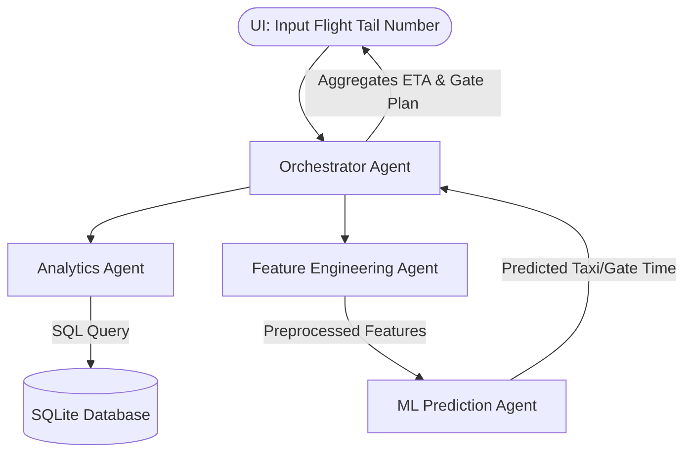
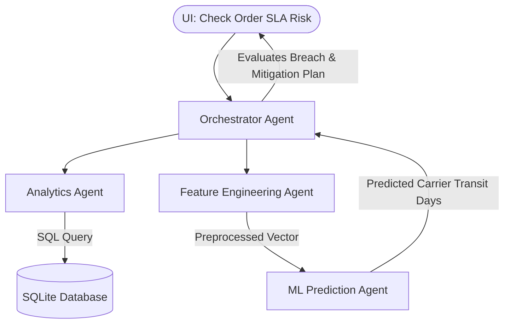

# Kaggle AI Agents Capstone Project Proposals (Business Track)

This document outlines two high-impact, realistic proposals for the **Agents for Business** track of the Kaggle AI Agents Capstone Project. Both designs are built around the multi-agent system architecture defined in your initial sketch: [Architecture_Capstone_VibeCoding.drawio.pdf](file:///Users/jigar/Downloads/Architecture_Capstone_VibeCoding.drawio.pdf).

---

## Proposal 1: Smart Airline Turnaround & Delay Mitigation Agent

### 1. Business Context & Problem Statement
Airlines lose millions of dollars due to flight delays. A critical operational bottleneck is **gate turnaround time**—the period an aircraft is on the ground between flights (deplaning, cleaning, fueling, baggage loading, and boarding). 
When an incoming aircraft arrives late, the operations manager needs a highly realistic Estimate Time of Departure (ETD) for the next flight utilizing that same plane, taking into account current airport traffic, crew schedules, and active gate constraints.

### 2. Dataset & Target Metrics
* **Dataset:** [US DOT Flight Delays & Cancellations (Kaggle)](https://www.kaggle.com/datasets/usdot/flight-delays)
* **Target Metric:** Estimated Time of Departure (ETD) delay (in minutes).
* **Key Variables:** `LATE_AIRCRAFT_DELAY` (incoming delay), `AIR_SYSTEM_DELAY` (airport congestion), `TAXI_OUT` (taxi queue time), `AIRLINE` & `ORIGIN_AIRPORT`.

### 3. Database Schema (SQLite: `airline_ops.db`)
* **`flight_schedules`**:
  * `flight_number` (Primary Key), `tail_number`, `scheduled_departure_time`, `origin_airport`, `destination_airport`.
* **`active_delays`**:
  * `tail_number`, `incoming_delay_minutes`, `reason` (e.g. Weather, Air System).
* **`airport_stats`**:
  * `airport_code`, `avg_taxi_out_minutes`, `current_queue_length` (backlog of departing flights).

### 4. Agentic Workflow

* **Analytics Agent:** Queries `airline_ops.db` to check how late the incoming plane is, how congested the origin airport is, and the historical gate turnaround time for that airline/airport combination.
* **Feature Engineering Agent:** Combines the database metrics with operational thresholds (e.g., calculates a `Congestion_Index` based on current departure queues).
* **ML Prediction Agent:** Predicts the *active taxi-out time* and *gate turnaround buffer* using a regression model trained on the DOT dataset.
* **Orchestrator Agent:** Computes the total ETD:
  $$\text{ETD Delay} = \text{Incoming Aircraft Delay} + \text{Predicted Turnaround Time} + \text{Airport Taxi Congestion}$$
  If the ETD slips past 30 minutes, it automatically generates a mitigation plan: *"Pre-board passengers 10m early and swap gate priority with flight UA204 to minimize delay propagation."*

---

## Proposal 2: E-Commerce Logistics Fulfillment & SLA Breach Predictor

### 1. Business Context & Problem Statement
For e-commerce marketplaces, delivering packages on time is critical for customer retention. Logistics managers need to identify orders at risk of breaching their Service Level Agreement (SLA) before the carrier misses the delivery window. This allows the business to proactively alert customers, reroute shipments, or coordinate with carriers.

### 2. Dataset & Target Metrics
* **Dataset:** [Brazilian E-Commerce Dataset by Olist (Kaggle)](https://www.kaggle.com/datasets/olistbr/brazilian-ecommerce)
* **Target Metric:** Probability of SLA breach / Estimated Delivery Date (EDD).
* **Key Variables:** `shipping_limit_date`, `order_delivered_carrier_date`, `product_weight_g`, `customer_zip_code_prefix`, `seller_zip_code_prefix`.

### 3. Database Schema (SQLite: `ecommerce_logistics.db`)
* **`active_orders`**:
  * `order_id` (Primary Key), `customer_id`, `seller_id`, `purchase_timestamp`, `promised_delivery_date`.
* **`order_items`**:
  * `order_id`, `product_id`, `weight_g`, `volume_cm3`.
* **`carrier_performance`**:
  * `route_id` (Seller-to-Customer region), `carrier_name`, `historical_avg_transit_days`, `current_backlog_score`.

### 4. Agentic Workflow

* **Analytics Agent:** Queries `ecommerce_logistics.db` to calculate the distance between the seller and customer, and checks the carrier's historical transit performance on that specific route.
* **Feature Engineering Agent:** Aggregates product volume, weight, and carrier backlog scores into a standardized feature vector.
* **ML Prediction Agent:** Evaluates the feature vector to predict the *carrier transit days* (regression or classification).
* **Orchestrator Agent:** Compares the predicted transit days against the `promised_delivery_date`.
  * If $\text{Purchase Date} + \text{Predicted Transit Days} > \text{Promised Date}$, it flags the order as a **High SLA Breach Risk**.
  * It suggests an automated action: *"SLA breach risk: 87%. Route this order via Express Post instead of Standard Post to save 2 days."*

---

## Comparison Table to Help the Team Decide

| Criteria | Proposal 1: Airline Gate Turnaround | Proposal 2: E-Commerce Logistics |
| :--- | :--- | :--- |
| **Real-world Appeal** | High (cool factor of aviation operations) | Very High (standard SaaS/marketplace issue) |
| **Data Complexity** | Medium (straightforward time metrics) | High (relational tables: geo, products, orders) |
| **Agent Synergy** | Excellent (clear hand-offs between agents) | Strong (highly focused on business policy/routing) |
| **ML Modeling** | Regression (predicting delays/durations) | Classification / Regression (SLA breach / transit time) |
| **UX Demonstration** | Interactive timeline delay breakdown | Logistics map / order priority warning dashboard |
